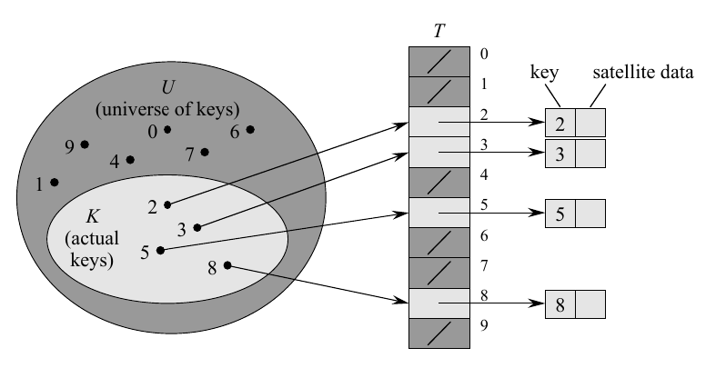
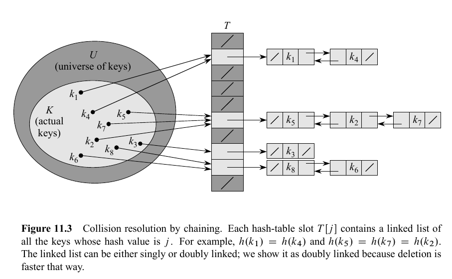

# what is this about?
> Today we're looking at hashing. We'll get into the process, the data structures and some applications.    
>
Through this article, we'll see how we can implement **dictionary** operations, which are mainly:   
1. insert
2. delete
3. search   

# what is Hashing?
Hashing is a **technique** of identifying an object out of a group of similar objects.    

**Analogy for hashing**:
Imagine if you took your name "tiwariji" and ran it through a complex mathematical function that produced "7a3f9c2e". You couldn't look at "7a3f9c2e" and figure out it came from "tiwariji", but every time you hash "tiwariji" you'd get the same result.     
That, is hashing.     
Ideally, no two different inputs should produce the same hash output. We'll talk about that later when we discuss [hash functions](#hash-functions).     

There are different ways you can create your hashing function.    
This also means there are different ways to hash.    
We'll first look at [DAT (direct addressing tables)](#direct-addressing-table) and see how, without hashing, we can use a normal array and use that to store values and fetch information in worst-case O(1).    


## Direct Addressing Table
Direct addressing is a simple technique. We assume a *universe* of numbers. And we store data in a **direct addressing table**.    
We represent DAT as T[0, ..., m-1] in the universe of `m` elements.     
Each *slot* in T, represents a value from the universe of elements.     
     
In the image, the table *T* stores value corresponding to the elements in the universe.     
In the rest of the article, I'll avoid using highly mathematical notations and just say things like "out of the set of keys" instead of "in the universe of elements" for the sake of simplicity.   

The problem with direct addressing is obvious.      
> Imagine you need to store data about students using their student ID numbers. If student IDs are 9-digit numbers (like 100000000 to 999999999), direct addressing would require an array with _900 million slots_ — even if you only have 500 students! You'd be wasting enormous amounts of memory, with 99.9999% of the array sitting empty.

<br>
Below is the code for a simple frequency hash map that maps characters to their corresponding indexes based on their relative order in the alphabet.    
Ex: b - 1, c- 3...
<br>

```python
class SimpleFreqHashTable:
    '''
    Docstring for SimpleFreqHashTable
    
    simple hashtable to store frequency of lower case
    alphabets in an array of size 26.
    
    '''
    def __init__(self, size = 26):
        self.size = size
        self.hashTable = [0] * size

    def hash(self, key):
        '''
        Docstring for hash
        index using a - 0, b - 1 
        '''
        return ord(key) - ord('a')

    def insert(self, key):
        index = self.hash(key)
        if 0 <= index < 26:
            self.hashTable[index]+=1
    
    def search(self, key):
        ind = self.hash(key) 
        return self.hashTable[ind]

```


Question. If you have arbitrarily big numbers, how do you create such a big table?

## hash tables

Hash tables fix this issue. They work because each slot in the table now holds h(k) for any key k where `h` is a [hash function](#hash-functions).   
That means you can create a **good hash function** and you can effectively fit large amounts of data in a smaller table.
The hash function reduces the range of array indices and hence the size of the array needed. Instead of a size of |U|, the table can have size `m`.
There is one issue though, they are called [collisions](#collisions).

## collisions

When two different keys hash to the same output, we call that situation a **collision**.
In an ideal world, there would be no collisions. But since we live in the real world, we'll see ways to handle this problem.       
One of the best ways to do that, is by a process called [chaining](#chaining).

### chaining 
In chaining, we use a data structure called linked list and store all the values that hash to the same index in a chain.   
**Example**:
- say two keys: `k1`, `k2` hash to same value `index`.    
- Then we take that index and make a chain and store k1 and k2.     
- Below is an example from the classic CLRS book.   


- 
<br>
Below is the code for a little custom hash class with chaining using a singly linked list.      


```python
class Node:
    def __init__(self, val):
        self.val = val
        self.next = None

class HashChaining:
    '''
    assumption:
    hash function will return an integer from 0 to 19
    '''

    def __init__(self, size = 20):
        self.size = size
        self.table = [None] * size

    def hash(self, key):
        if isinstance(key, str):
            return ord(key) % self.size
        return key % self.size

    def insert(self, s):
        index = self.hash(s)
        if self.table[index] is None:
            head = Node(s)
            self.table[index] = head
        else:
            new = Node(s) 
            new.next = self.table[index] 
            self.table[index]= new

    def search(self, s):
        index = self.hash(s)
        if self.table[index] is None:
            return "not hashed"
        l = self.table[index] 
        curr = l
        while curr:
            if curr.val == s:
                return "found the value"
            curr = curr.next
        return "THE VALUE ISNT PRESENT"
```


### Hash Functions

Ideally, a hash function should:
- satisfy the condition of [uniform hashing](#uniform-hashing).
- minimize collisions.
- be easy to implement and should not become an algorithm in itself.    

There are different methods to generate slot indices.   

1. **DIVISION METHOD:** h(k) = k mod m.
2. **MULTIPLICATION METHOD**: this method works in two ways. 
		> first we take the *fractional* part of kA where A is any constant.
		> then we multiply that by *m* and then we take the floor of the result.

 
> ***Interpreting keys as natural numbers***
> We want the keys to be integers. If they are not integers, we make an interpretation. 
> Say there is `pt`. We can interpret this as `112` `116` because `p` is `112` and `t` is `116` in ASCII notation.


### Probing 

One way to avoid collisions is probing.     

**IDEA**:
   - For a key k, we check the hashed index and see if it's free. If it's not, we check the next slot, and then the next...
$$ 
slot for k = ((h(k) + i) mod (m))
$$
where i is in range [0, size_of_table)     
<br>
Below is the code for making a hash function with linear probing.   

```python
class HashChainingWithProbing:
    '''
    assumption:
    hash function will return an integer from 0 to 19
    '''

    def __init__(self, size = 20):
        self.size = size
        self.table = [None] * size

    def hash(self, key):
        if isinstance(key, str):
            return ord(key) % self.size
        return key % self.size

    def insert(self, s):
        index = self.hash(s)
        new = Node(s)
        for i in range(self.size):
            new_index = (index + i) % self.size
            if self.table[new_index] is None:
                self.table[new_index] = new
                break
    
    def search(self, s):
        index = self.hash(s)
        for i in range(self.size):
            new_index = (index + i) % self.size
            if self.table[new_index] is None:
                return "this index is not hashed."
            if self.table[new_index].val == s:
                ok = True
                return "found it"
        
        return "couldn't find it"

```


## Universal Hashing
The idea is this:
Use *randomness* to create **unique** hash functions that map keys to different slots.    

We do this by first choosing **random** numbers `a` and `b`. By generating two random numbers for creating the function, we're solidifying the uniqueness of the function.      
Then
$$
h(k) = ((ak+b) mod p)
$$

where `p` is a prime number greater than the universe of keys, so that each key k is in the range [0, p-1]. 


## Applications.
**Associative arrays:** Hash tables are commonly used to implement many types of in-memory tables. They are used to implement associative arrays (arrays whose indices are arbitrary strings or other complicated objects).
**Database indexing:** Hash tables may also be used as disk-based data structures and database indices (such as in dbm).
**Caches**: Hash tables can be used to implement caches i.e. auxiliary data tables that are used to speed up the access to data, which is primarily stored in slower media.
**Object representation**: Several dynamic languages, such as Perl, Python, JavaScript, and Ruby use hash tables to implement objects.     
<br> 
With that, we finish today's article.   
Thanks for reading.     


~ Aayushya Tiwari
---


## References
: CLRS textbook of algorithms. Also called **Introduction to Algorithms**
[Hackerearth](https://www.hackerearth.com/practice/data-structures/hash-tables/basics-of-hash-tables/tutorial/#/)


---
##### Uniform hashing
It is the assumption that each key in the universe of elements hashes to any slot in table T with equal probability, independent of where other keys hash.