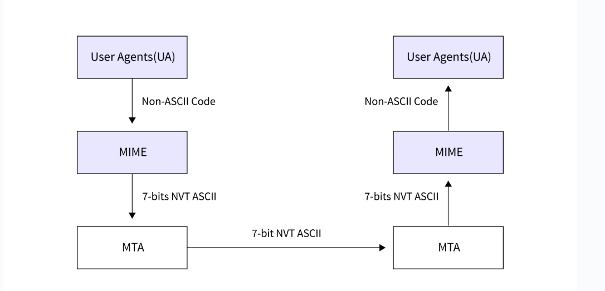

Some days back I was studying for computer networks exam. I came across few protocols which were very interesting. Like SMTP (Simple Mail Transfer Protocol), telnet, SCP (Secure Copy Vulnerability) just to name a few.      

# SMTP and a little bit of theory

Simple Mail Transfer Protocol is a protocol used to transfer mails over servers. It was written in 1981. IT works on port number 25. Since SMTP is server-to-server, the client port number is 587.      

There were, however, issues with SMTP. For one, it was ONLY for 7Bit ASCII, second the data was unencrypted. For addressing these issues, MIME standard was developed. It is an internet standard that extends the message format of email to support non-ASCII characters.     
SMTP -> transport
MIME -> about the message

## The idea 
Idea behind MIME is this:
SMTP could already share text data (7-bit ASCII) over servers. The question MIME devs had to handle was how do you or could you share data like images and videos and audios encoded as text?     
Turns out, you could.       

##  The MIME working


So, we can send emails using different protocols with the [mime header format](#mime-header). We can understand MIME as this set of software functions that transform the ASCII data to non-ASCII data and back.     


## MIME Header

MIME header consists of the following data that is attached to each email.    

- Version: What MIME version was this encoded data encoded with.
- Content-type: Describes the type and subtype of content.
- Content-transfer-encoding: Describes the encoding format.
- Content-ID: Unique ID to content.
- Content-Description: Describes type of data present in the body.      

# Script to transfer images over ssh and using scp


Idea this:

>"Since I can transfer .txt files over scp (again, I didn't know you could just transfer images), how about I take images encode them (just like MIME) and transfer that over scp and using ssh decode them on the other machine?"      

I did just that.     

So here's a script that you can use to overcomplicate the image sharing process over SCP :P     

```python
#!/usr/bin/env python3
import argparse
import base64
import subprocess
import os

parser = argparse.ArgumentParser()
parser.add_argument('--image_path', required=True)
parser.add_argument('--scpIP', required=True)
parser.add_argument('--scpPassword', required=True)
args = parser.parse_args()

# Read and encode image
with open(args.image_path, 'rb') as f:
    encoded = base64.b64encode(f.read()).decode()

# Write to temp file
temp_file = '/tmp/image_transfer.txt'
with open(temp_file, 'w') as f:
    f.write(encoded)
try:
    subprocess.run(['sshpass', '-p', args.scpPassword, 'scp', temp_file, f'{args.scpIP}:~/'], check=True)
    subprocess.run(['sshpass', '-p', args.scpPassword, 'ssh', args.scpIP, 'cat ~/image_transfer.txt | base64 -d > ~/decoded_image'], check=True)
    print("Image transferred and decoded on remote machine as ~/decoded_image")

except subprocess.CalledProcessError:
    print("couldn't reach the ip")
finally:
    os.remove(temp_file)
```

Following up from my [last essay](https://tiwariji.net/posts/notes-on-argparse/), you can see I have used the good old `argparse` library to take arguments from CLI.       
The arguments are:
- `image_path`: path to the image file
- `scpIP`: your remote machine's IP where you want to copy this file to
- `scpPassword`: your remote machine's password

You can see there are two python libraries that I've used.     
`base64` and `subprocess`

- base64: its the encoding format of the image. Its similar to what `content-transfer-encoding: base64` (remember from [MIME HEADER FORMAT](#mime-header)) means. 
- subprocess: its used to do SSH and SCP in python

## Steps:
1. We take the image.
2. We encode it to `.txt` in base64 format.
3. We use the IP and password to first, transfer the .txt over scp to the machine and then ssh over that machine using the same credentials to do **.txt -> image** using:
```python
subprocess.run(['sshpass', '-p', args.scpPassword, 'ssh', args.scpIP, 'cat ~/image_transfer.txt | base64 -d > ~/decoded_image'], check=True)
```
The complicated bash line is just piping. You take the output from the first command and make that the input for the other command. And so we use the bash command `base64 -d` to decode the .txt content to convert it to image format.        

<br>

or you could just do scp and then transfer image over your internet :)    

<br>

I did not know that you could transfer images data over scp. I did not question that either.       
Which is my bad.     
You can, it turns out.     
But I had this idea and I executed it.       
Which is fine.

<br>
<br>

> A little question: do you think the resolution of the image will be changed if you transfer images like this?      
Hint: A good thing to think about is the data. Are we losing data in this process? 


Thanks for reading      
~ Aayushya Tiwari

# References

- SSH wiki: (https://en.wikipedia.org/wiki/Secure_Shell)
- GFG article on SMTP: (https://www.geeksforgeeks.org/computer-networks/simple-mail-transfer-protocol-smtp/)
- my repo for code : (https://github.com/aayushyatiwari/minimalistic_image_transfer_over_scp)
