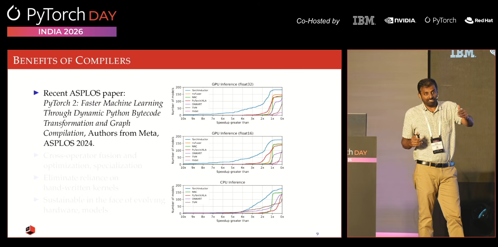
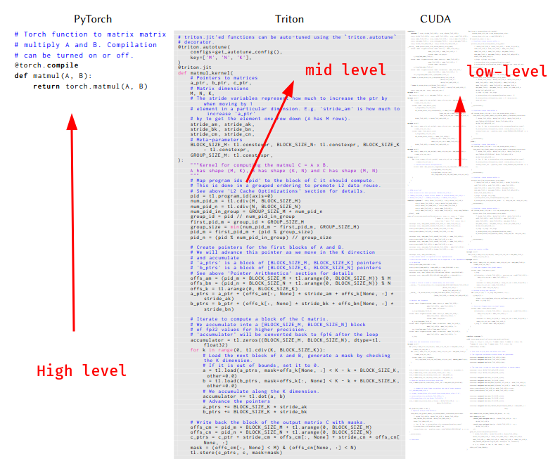
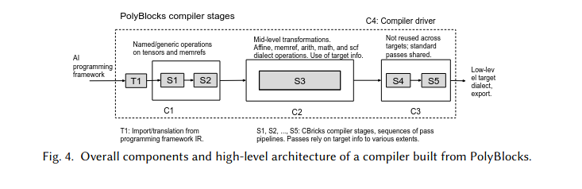

Recently, at PyTorch Day India in Bangalore, I saw a talk on AI compilers.
Here is the link: [YouTube](https://www.youtube.com/watch?v=upzLl0mp74I)


##### Picture from the session


<br>
I didn't know there were Indian labs working on the AI compiler problem. But it turns out there are.

***PolyMage Labs*** is an IISc lab in Bangalore working on [PolyBlocks](https://arxiv.org/abs/2603.06731).

Since AI is moving fast, there is a clear need for efficient AI compilers that can lower high-level tensor programs to IR for GPUs, TPUs, and other backends. PolyBlocks minimizes dependency on external vendor libraries like cuBLAS/cuDNN while still generating highly optimized code via compiler-driven transformations and tiling.

### What is Polyblocks?     
It's an AI compiler architecture built in PolyMage labs.        

On 10th March, they released their [paper](https://arxiv.org/abs/2603.06731).       

This essay will go in depth on the paper and PolyBlocks compiler abstractions.

# introduction

Since these "AI" compilers are also "compilers", they have abstraction layers just like traditional compilers.

There are high-level abstractions:
- Pytorch, Tensorflow, JAX

There are mid-level abstractions:
- Triton, Pallas

There are low-level abstractions:
- cuBLAS, cuDNN, ROCm, Cutlass etc          

In the paper, they've described the difference between these three abstractions.        

Here is a brief flowchart of how this works.        


**PyTorch**  →  aten ops  →  linalg  →  affine  →  LLVM IR  →  GPU binary       
**JAX**      →  stablehlo →  affine  →  LLVM IR  →  GPU binary      
**TensorFlow** → mhlo    →  affine  →  LLVM IR  →  GPU binary

          

Specifically for Polyblocks, it is registered as a torch backend and has its own plugs for Tensorflow and JAX respectively.     

Let's without further ado look at the architecture.     
Also, one common word in the paper is the word "dialect". It's from the 2020 paper on MLIR. Rest of the article will use it too so maybe get [familiar](#dialect) with it first.        

[click here](#dialect)

# architecture

Polyblocks has a 5-stage pipeline from S1 to S5.    
       

## Frontend stage: S1, S2
These stages are *target-neutral* and do not depend on specific hardware.

The frontend is responsible for canonicalization of high-level ops and conversion into lower-level MLIR dialects:
1. Lower operations from **tensor dialect** to **memref dialect** in S1.
2. Lower named tensor ops on memrefs to [affine nests](#affine_nests) in S2.


## Mid-level optimization
S3 is the mid-level optimization level. It takes only *memref* and *affine* dialects of MLIR and does 50-70 passes for one target.      
Things that happen in this stage:
1. fusion
2. tiling
3. mapping to matrix units
4. generation of data movement code for on-chip memories
5. vectorization

So, we now have nicely optimized affine loop nests. They are still written as abstract `affine.for` loops and `affine.parallel` ops, which are later lowered in backend stages.

## Backend stages
This is where we make the architectures compatible with different hardware.     
What now happens is this:       

### S4:
> affine dialects -> GPU dialects

These stages are hardware dependent. Meaning each hardware gets different inputs.       


### S5:
S4 still produces MLIR operations. S5 takes that and converts everything down to LLVM IR — the final common language before machine code.       

### For NVIDIA GPU:
> gpu dialect  →  nvvm / nvgpu dialect  →  LLVM IR  →  NVPTX  →  CUDA binary (cubin)
### For AMD GPU:
> gpu dialect  →  amdgpu / rocdl dialect  →  LLVM IR  →  HSACO binary
### For CPU:
> omp dialect  →  LLVM IR  →  native binary


## Compiler driver
C4 is the compiler driver stage. It is written python.      
What it does:
1. contains *pass-pipeline* for all stages.
2. contains support for convert the graph form of different high-level frameworks to MLIR.
3. also contains logic for JIT compiling inputs to outputs.
4. support for *ahead-of-time* compilation.
5. kernel launches and synchronization


# optimizations
One of the most important things in PolyBlocks and which makes it special is the fact that it uses *[affine](#affine_nests) memory pattern*.          
Also the fact that it uses MLIR to handle its low-level code.         
Before talking about the fusion approach I'd like you to know about the producer-consumer terminology.        
It's pretty straightforward.       
Consider:
```python
A = relu(X)
B = matmul(A, W)
```
Here, `relu` is the *producer* and `matmul` is the *consumer*.        
Simple.        
Now, let's talk about the fusion approach in PolyBlocks.
## slicing based fusion approach
The idea is this:        
In traditional fusion, we just merge loops directly.   
ex:       
```python
# Two separate loops
for i in range(N):
    A[i] = X[i] * 2      # producer
for i in range(N):
    B[i] = A[i] + 1      # consumer
# FUSED
for i in range(N):
    A[i] = X[i] * 2
    B[i] = A[i] + 1      # A[i] stays in register
```
Why this would fail:
```python
for i in range(N):
    A[i] = X[i] + X[i+1]    # producer, needs neighbors
for i in range(N):
    B[i] = A[i] + A[i+1]    # consumer, also needs neighbors
# A[i+1] is not computed yet!
```
This is why PolyBlocks wins here. Because it uses affine memory access and we can look at each compute and index it — so it knows exactly which slice of the producer a consumer needs, and pulls just that in.

PolyBlocks has evaluations for fusion. The specific evaluations mentioned in the paper are:
1. preservation of parallelism
2. preservation of [vectorizability](#vectorizability)
3. amount of redundant computations added
4. will the fusion eliminate intermediate buffer?

Beyond slicing-based fusion, PolyBlocks does a few more things worth naming. Tiling breaks large loops into small chunks that fit in fast memory — but the trick is you have to tile the destination first, then fuse sources into it, not the other way around. Attention gets special treatment too: the softmax in the middle makes standard fusion impossible, so PolyBlocks uses two passes to first eliminate DRAM roundtrips, then shared memory roundtrips, keeping everything in registers. Convolutions are quietly converted into matmuls on-the-fly so they reuse the same optimized path. 

# results and benchmarks of PolyBlocks

The paper evaluates PolyBlocks on NVIDIA A100 and A10 GPUs, comparing against Torch eager, Torch Inductor, TensorRT, and XLA.

For PyTorch models at batch size 1, PolyBlocks is *2.15x faster* than eager execution on average, *1.4x faster* than Inductor, and *2.4x faster* than TensorRT. At batch size 8, it's *1.8x faster* than eager and roughly on par with Inductor. The gap over Inductor is higher at smaller batch sizes — which makes sense, because Inductor's underlying vendor libraries are tuned for large batches.

For JAX, PolyBlocks is 2.12x faster than JAX eager and 1.15x faster than XLA on average.

The individual operator results are arguably more impressive. For convolutions, PolyBlocks-generated code is competitive with cuDNN — and in nearly 50 cases actually beats it by more than 2x. For matmuls, it tracks closely with CuBLAS across a wide range of sizes. Remember, these are libraries that teams at NVIDIA have hand-tuned for years. Getting close without a single hand-written kernel is the whole point.

The ablation study isolates what actually matters. Tensor cores alone give a 17x speedup. Cross-operator fusion gives 2.87x on top of that. Reduce-reduce fusion for attention gives another 1.42x. The numbers make the argument cleanly that fusion is not a nice-to-have, it's most of the performance.

For quantized models the gains are even more dramatic, since Inductor has limited support for optimization in the presence of quantization. PolyBlocks handles it naturally because quantization just becomes more affine ops in the same pipeline.


# Conclusion
The paper was a fantastic and in-depth read. It broke some assumptions like the fact people used to believe you can't compare with libraries like cuDNN because of how many years of work that is and how optimized it is.      
PolyBlocks proves you don't. If your tiling, packing, and tensor core mapping are right, the generated code gets there.
While PolyBlocks is still not complete, because features like cross-attention are yet to be implemented, its still on-par with libraries that have been in the game for years. If that's not exciting, I don't know what is.        

Kudos to the PolyBlocks team!       

With that, we end this paper review.        
I had fun, I hope you did too.      

Thanks for reading
~ Aayushya Tiwari       

<br>
<br>
<br>
<br>
<br>
<br>
<br>


# References

- [PolyBlocks paper (arXiv)](https://arxiv.org/abs/2603.06731)
- [PyTorch Day India talk (YouTube)](https://www.youtube.com/watch?v=upzLl0mp74I)

# Appendix
## affine_nests
A loop nest is affine if every array index is a linear function of the loop variables. No multiplying loop vars together, no data-dependent indexing.
```python
A[i][k] — affine ✓ (just i and k)
A[i*k] — NOT affine ✗ (product of two loop vars)
A[data[i]] — NOT affine ✗ (index depends on runtime data)
```
## dialect

**A dialect is just a named collection of operations.**

Example — the `arith` dialect contains operations like:
```
arith.addf   (floating point add)
arith.mulf   (floating point multiply)
arith.cmpi   (integer compare)
```

The `affine` dialect contains:
```
affine.for       (a loop with affine bounds)
affine.load      (load from memory with affine index)
affine.store     (store to memory with affine index)
```

---

**Why have multiple dialects?**

Because different levels of abstraction need different operations.

At the top level you want to say `matmul(A, B)`. At the bottom level you want to say `load this address, multiply these floats, store result`. These are very different vocabularies. Each dialect captures one level.

**The dialects in the paper, ordered high to low:**

```
linalg / mhlo / stablehlo   ← named tensor ops (matmul, conv)
         ↓
      affine                 ← explicit loop nests, affine accesses
         ↓
    memref / scf             ← raw memory, generic loops
         ↓
    gpu / nvvm / nvgpu       ← GPU specific ops, warp primitives
         ↓
       llvm                  ← almost assembly
```
now you can look at the [architecture](#architecture)

## fusion
Running multiple operations in one GPU kernel instead of running multiple kernels for operations is called Fusion.      

The benefit: intermediate results stay in fast memory (registers or shared memory) instead of being written to DRAM and read back.

```python
# Without fusion: 2 kernel launches, A goes to DRAM between them
A = relu(X)      # kernel 1 → writes A to DRAM
B = A + 1        # kernel 2 → reads A from DRAM

# With fusion: 1 kernel launch, A stays in registers
for each element:
    a = relu(x)
    b = a + 1    # a never touches DRAM
```

DRAM is ~100x slower than registers. So the more you can keep intermediate results in fast memory, the faster your model runs. That's the whole point of fusion.