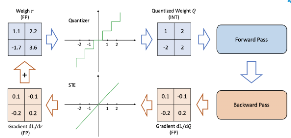

**"compute solves a lot of problem"**       

If we just had enough compute, a lot of the problems that we experience today would be solved. Loger contexts, smarter weights and biases, etc. But right now we don't have infinite compute.       
That's the sad reality.     
So we optimize. **Quantization** is our attempt at just that.       

# history
Reference: https://arxiv.org/abs/2103.13630         

Quantization is a way of compression. It is a process of mapping a large set of continous or high-precision values into smaller discrete set of values.       
> **Formally**:         
> *Input*: A continuous or high-precision value (e.g., a real number between -1.0 and 1.0 with 32-bit floating point precision).      
*Output*: A discrete value chosen from a limited set of levels (e.g., integers from -128 to 127 in 8-bit).        

Put simply, say you have data in *floating point 32 bit* format. I tell you, put that data in *Int 8* format. You see, the bit difference is 32 -> 8. And you do it.              
Congrats, you just quantized your data.       

You have used rounding-off in elementary math classes too right?        
That is an example of quantization.     
Digital signal processing, audio/video compressions are other examples.     

# quantization and neural nets
In neural nets, we have data. A lot of it actually.     
Gradients, activations, other data that we don't know about when training/inferencing a nn.     

The benefits of quantization as you can guess already are:
- **faster inference**
- **lower model memory**
- **lower power consumption**

It's nice to be aware of different interesting formats we have in machine learning so you don't get lost further in the essay.       
the common ones are:        

| format | bits | range        | notes                              |
| ------ | ---- | ------------ | ---------------------------------- |
| FP32   | 32   | ~±3.4 × 10³⁸ | standard training format           |
| FP16   | 16   | ~±65504      | half precision                     |
| BF16   | 16   | ~±3.4 × 10³⁸ | same range as FP32, less precision |
| INT8   | 8    | -128 to 127  | signed                             |
| UINT8  | 8    | 0 to 255     | unsigned                           |
| INT4   | 4    | -8 to 7      | aggressive quantization            |
| INT2   | 2    | -2 to 1      | extreme, rarely used               |


# the quantization function


$$Q(r) = Int(r/S) − Z$$     

`Q` is the function.        
`r` is the multi-dimensional tensor to be quantized.      
`Int()` maps a real value to an integer value through a rounding operation (e.g., round to nearest and truncation)      
`S` is the ***scale*** value. Very important in the process.      
`Z` is the ***zero point*** value, also very important calculations for this.       

## Scale and Zero Point

Quantization maps a float range $[\alpha, \beta]$ to an integer range $[q_{\min}, q_{\max}]$.

For $n$-bit quantization:

$$q_{\min} = -2^{n-1}, \quad q_{\max} = 2^{n-1} - 1$$

For 8-bit: $q_{\min} = -128$, $q_{\max} = 127$.

### Asymmetric

The float range is taken directly from the tensor:

$$\alpha = \min(w), \quad \beta = \max(w)$$

$$s = \frac{\beta - \alpha}{q_{\max} - q_{\min}}$$

$$z = \text{clamp}\left(\left\lfloor q_{\min} - \frac{\alpha}{s} \right\rceil,\ q_{\min},\ q_{\max}\right)$$

### Symmetric

The range is forced to be symmetric around zero:

$$\beta = \max(|w|), \quad \alpha = -\beta$$

$$s = \frac{2\beta}{q_{\max} - q_{\min}}$$

Since $\alpha = -\beta$, the zero point always works out to $z = 0$.
This is why symmetric quantization is preferred for weights —
you eliminate $z$ from every multiply-accumulate entirely.      

This is how you'd implement something like this in python.      

```py
def get_scale_zero_point(tensor, symmetric=True, n_bits=8):
    qmin = -(2 ** (n_bits - 1))
    qmax = (2 ** (n_bits - 1)) - 1

    # asymmetric 
    if not symmetric:
        alpha = tensor.min().item()
        beta = tensor.max().item()

    # syummetric
    else:
        beta = tensor.abs().max().item() # max value of the tensor
        alpha = -beta

    # standard scaling 
    scale = (beta - alpha) / (qmax - qmin)
    if scale == 0:
        scale = 1e-8 # avoid division by zero
    zero_point = round(qmin - alpha / scale)
    zero_point = max(qmin, min(qmax, zero_point))
    return scale, zero_point
```


## accuracy drop?
One question you could ask is:
"we're using 8 bits instead of 32 bits to store the same information, aren't we losing data?"       

You are.        
But how much is where the story begins.     


# Quantization: Methods
Let's look at some code and numbers.        

## QAT
Another way of quantized training is 'QAT' is Quantized Aware Training.       

You tell the baker upfront that the cake will be served in rougher slices. They bake accordingly.       

During training, you simulate quantization — fake quantization nodes are inserted into the graph. The forward pass mimics low precision. But the backward pass still uses full precision gradients. The model learns to be robust to the quantization noise. By the time you actually quantize at deployment, the weights have already adapted.



This has issues because this asks of us to essentially use more compute by also using the quantized weights. But this gives the least accuracy drop.    
As I said in the beginning of the essay, compute can solve a lot of our problems.       


### Fake quantization 
Here's the setup:
I trained a little CNN on MNIST and exported the weights. You can have a look at the code [here](https://github.com/aayushyatiwari/blogCode)        

I then took the same model architecture and quantized the weights this time.        
Using the formulas that I defined [earlier](#scale-and-zero-point).        
What I am doing here is essentially **simulating** a quantization process.      

```py
class QuantizedModel(nn.Module):
    ... # init methods....
    .
    .
    . 
    def quantize_weights(self):
        """Quantize each layer’s weights independently after loading FP32 weights."""
        for name, module in self.named_children():
            if isinstance(module, (nn.Conv2d, nn.Linear)):
                weight = module.weight.data
                scale, zp = get_scale_zero_point(weight, symmetric=self.symmetric, n_bits=self.bitwidth)
                q_weight = quantize(weight, scale, zp)

                setattr(self, f"{name}_q", q_weight.clone().detach())
                setattr(self, f"{name}_scale", torch.tensor(scale))
                setattr(self, f"{name}_zp", torch.tensor(zp, dtype=torch.int32))  

                # dequantize
                module.weight.data = dequantize(q_weight, scale, zp)

```
Again all the code is present [here](https://github.com/aayushyatiwari/blogCode).       
In this snippet you see a method defined in the quantized model class.      
This model loads a pre-trained model and when you call `model.quantize_weights()`, this method is called.       

You see that we `quantize` the `weight` tensor and store that in a different buffer.         
and IMMEDIATELY `dequantize` it!        
This produces an effect of quantization while still all the operations are in floating point 32 only.       
This type of simulation is useful while studying accuracy drops only since the memory load and inference speeds are the same.     

```py
(torchgpu) quantization\ $ python train.py
using: cuda
epoch 1 loss: 0.1336
epoch 2 loss: 0.0444
epoch 3 loss: 0.0299
epoch 4 loss: 0.0212
epoch 5 loss: 0.0176
saved to mnist_model.pth
FP32 test loss: 0.0305, accuracy: 0.9907
Quantized test loss: 0.0305, accuracy: 0.9907

```
This was the **symmetric** uniform quantization code.       
See this part of the result:

```py
FP32 test loss: 0.0305, accuracy: 0.9907
Quantized test loss: 0.0305, accuracy: 0.9907
```
The FP32 is the actual model and its accuracy on a test set.        
The quantized one is where we simulated the quantization effect.        
As we can see, the loss is absolutely same. The training and inferencing was done on a very little data (200-300 images) and that's why its absolutely negligible.      

You see, when I tried quantizing the weights in a ResNet18, the error I got from it was close to **0.2%**.      

Here's the code that was used along with the result:
```python
import torch
from load_model import load_model # loading ResNet18 model defined in load_model.py

def get_scale_zero_point(tensor, symmetric, n_bits=8):
    qmin = -(2 ** (n_bits - 1))
    qmax = (2 ** (n_bits - 1)) - 1
    # asymmetric 
    if not symmetric:
        alpha = tensor.min().item()
        beta = tensor.max().item()
    # syummetric
    else:
        beta = tensor.max().item() # max value of the tensor
        alpha = -beta
    # standard scaling 
    scale = (beta - alpha) / (qmax - qmin)
    zero_point = round(qmin - alpha / scale)
    zero_point = max(qmin, min(qmax, zero_point))
    return scale, zero_point
def quantize(tensor, scale, zero_point, n_bits=8):
    qmin = -(2 ** (n_bits - 1))
    qmax = (2 ** (n_bits - 1)) - 1
    q = torch.round(tensor / scale + zero_point)
    q = torch.clamp(q, qmin, qmax)
    return q.to(torch.int8)
def dequantize(q_tensor, scale, zero_point):
    return scale * (q_tensor.float() - zero_point)
if __name__ == "__main__":
    model = load_model()
    
    weight = model.conv1.weight.data
    print("original:", weight.shape, weight.dtype)
    print("min/max:", weight.min().item(), weight.max().item())
    sym = True # flag for symmetric quantization 
    scale, zp = get_scale_zero_point(weight, sym)
    print("scale:", scale, "zero_point:", zp, " in symmetric")
    
    q = quantize(weight, scale, zp)
    print("quantized dtype:", q.dtype)
    
    dq = dequantize(q, scale, zp)
    error = (weight - dq).abs().mean().item()
    print("mean abs error:", error)
```
Results:

```
# asymmetric
original: torch.Size([64, 3, 7, 7]) torch.float32
min/max: -0.8433799147605896 1.0164732933044434
scale: 0.007293541992411894 zero_point: -12  in asymmetric
quantized dtype: torch.int8
>>> mean abs error: 0.001590650761500001 

#symmetric
original: torch.Size([64, 3, 7, 7]) torch.float32
min/max: -0.8433799147605896 1.0164732933044434
scale: 0.007972339555328967 zero_point: 0  in symmetric
quantized dtype: torch.int8
>>> mean abs error: 0.0017431897576898336
```
Look at the mean abs error.        
That's how much information you're losing from `torch.float32` to `torch.int8`.     
And this is exactly why quantizing works. And libraries like pytorch are building APIs for quantized model training because as you can see, the data that is lost during this process is not that much and we can compress a model from say 16GB to ~3GB!       

## PTQ

You bake the cake first, then decide to slice it into rougher chunks.       

The model is already trained. You just convert the weights and activations to lower precision after the fact. You might run a small "calibration dataset" through it, not to train, just to observe what range of values the activations take, so you know how to map *floats* → *ints* without clipping too much.      
It's fast and easy. The downside: the model never knew it was going to be quantized, so it wasn't optimized for surviving that precision loss. Accuracy drops a bit, sometimes a lot.       

Here's a nn that I wrote to study PTQ.      

```py
class MNISTNet_q(nn.Module):
    def __init__(self):
        super().__init__()
        self.conv1 = nn.Conv2d(1, 32, 3, padding=1)
        self.conv2 = nn.Conv2d(32, 64, 3, padding=1)
        self.pool = nn.MaxPool2d(2, 2)
        self.relu1 = nn.ReLU()
        self.relu2 = nn.ReLU()
        self.relu3 = nn.ReLU()
        self.fc1 = nn.Linear(64 * 7 * 7, 128)
        self.fc2 = nn.Linear(128, 10)
        self.quantstud = torch.quantization.QuantStub()
        self.dequantstud = torch.quantization.DeQuantStub()

    def fuse_model(self):
        return torch.quantization.fuse_modules(self, [['conv1', 'relu1'], ['conv2', 'relu2']], inplace=True)

    def forward(self, x):
        x = self.quantstud(x)
        x = self.pool(self.conv1(x))
        x = self.pool(self.conv2(x))
        x = x.reshape(-1, 64 * 7 * 7)
        x = self.relu3(self.fc1(x))
        x = self.fc2(x)
        x = self.dequantstud(x)
        return x
```
Here we have normal layers like `Conv` and `Relu` but the vivid reader would see two different inits. `QuantStub` and `DeQuantStub`. These are used by pytorch.quantization API to quantize weights at the start of each forward so that each weight tensor gets quantized under-the-hood to `int8` and after the forward method we dequantize the weights back.        

You will notice we also defined a `fused_model` method. That is because we want to quantize modules together to efficiently do quantization.        
Doing quantization for each layer separately will lead to heavy compute usage and we don't want that (optimization, remember?)      


```py
if __name__ == "__main__":
    test_loader = get_test_loader()

    fp32 = MNISTNet_q()
    fp32.load_state_dict(torch.load('mnist_model.pth', map_location='cpu'))
    fp32.eval()
    fp32_loss, fp32_acc = evaluate(fp32, test_loader, 'cpu')
    print(f"fp32  | loss: {fp32_loss:.4f} | acc: {fp32_acc:.4f}")

    q_model = ptq('mnist_model.pth')
    q_loss, q_acc = evaluate(q_model, test_loader, 'cpu')
    print(f"int8  | loss: {q_loss:.4f} | acc: {q_acc:.4f}")

    print(f"\nconv1 weight dtype : {q_model.conv1.weight().dtype}")
    print(f"fc1   weight dtype : {q_model.fc1.weight().dtype}")
    print(f'q_model conv1 scale values caliberated during the process: {q_model.conv1.scale}')
    print(f'q_model conv1 zp values caliberated during the process: {q_model.conv1.zero_point}')
```
If we run this file using the above code, we get:

```
fp32  | loss: 0.5367 | acc: 0.9382
int8  | loss: 0.0291 | acc: 0.9908

conv1 weight dtype : torch.qint8
fc1   weight dtype : torch.qint8
q_model conv1 scale values caliberated during the process: 0.029921600595116615
q_model conv1 zp values caliberated during the process: 0
```
The `fp32` model is the same architecture loaded with pre-trained weights. But note: MNISTNet_q has QuantStub/DeQuantStub layers designed for PTQ, which interfere with normal fp32 inference. The `q_model` is the result after PTQ, where the architecture operates as designed. That's why the comparison isn't apples-to-apples — the fp32 number is artificially degraded by running quantization stubs in fp32 mode. 

So yeah, as you can see, the quantized model does pretty okay.  
And that shows why the quantization idea is so vividly talked about in ml and ai.       
I hope this makes things clear for you a little bit. It did for me definitely.      

I did not talk about a lot of technical details like ultra-quantization on 2-bits and stuff. But they are just built-up technical things on the same idea. You can read about them from [here](#references).        

PyTorch is moving the quantization to a separate package. Things are moving fast in the quantization field, are you keeping up? :)      

Thanks for reading.     
~Aayushya

# References
paper: https://arxiv.org/abs/2103.13630         
my code for this essay: https://github.com/aayushyatiwari/blogCode/tree/master/quantization/
