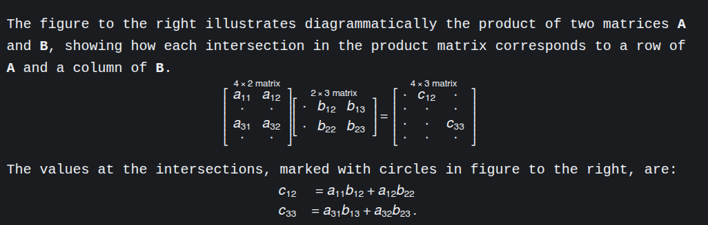
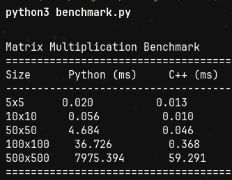
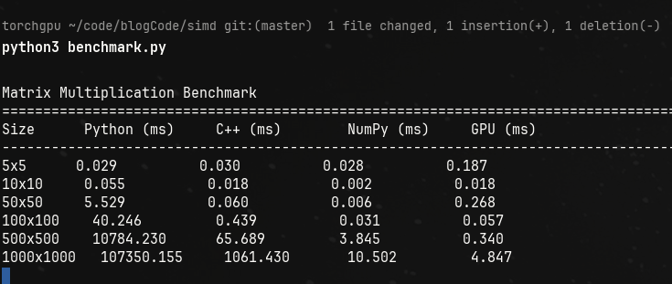

Today we look at matrix multiplication (matmul, as we will call in this essay).     
Since, the last essay was on [backprop](https://tiwariji.net/posts/backprop/), it was only logical to think about the most fundamental math operation that lets us do the algo.        
That is, matmul.   
Also, the numbers in this essay are going to shock you.     
Like really. So if you think I am making this up, you should checkout [my code](https://github.com/aayushyatiwari/blogCode/tree/master/simd) for this essay. 

In hindsight, it looks like a very normal operation to any math major or simply any other person who has done basic linear algebra but it is THE foundational op in deep learning and efficiently processing this compounds billions of times!       
In today's essay, we look at how computers in today's day and age do matmul and how GPUs changed the way.       


# what is matrix multiplication?
[Wiki](https://en.wikipedia.org/wiki/Matrix_multiplication)     
It is basically a basic math operation where we multiply two matrices to get another resultant matrix.      
Now, for matrix multiplication there is one condition. That is, the number of columns of the first matrix equals the number of rows in the second matrix.      
       
The operation, mathematically can be defined as this:



# Implementation
## Python
Let's write a function that multiplies two matrices in python.      
```python
def matmul_naive(m, n):
    im = len(m[0])
    result = [[0]*(len(n[0])) for _ in range(len(m))]
    for i in range(len(m)):
        for j in range(len(n[0])):
            result[i][j] = 0
            for k in range(im):
                result[i][j] += m[i][k] * n[k][j]
    return result
```
This is the naive way to multiply two matrices. You take the first row of the first matrix, you take the first column of the second matrix and using an *additional* var `k`, we store the product in `result[i][j]`.       

## C++ implementation
The same function but in c++ (for simplicity, we're assuming the matrices will be square matrices of size `n`).
```cpp
#include <bits/stdc++.h>

extern "C" {
    void matmul_naive_c(float* A, float* B, float* C, int n) {
        for (int i = 0; i < n; i++) {
            for (int j = 0; j < n; j++) {
                float sum = 0.0f;
                for (int k = 0; k < n; k++) {
                    sum += A[i*n + k] * B[k*n + j];
                }
                C[i*n + j] = sum;
            }
        }
    }
}
```
You will notice I have exported or "externed" the code to C. [I will tell you why I did that later in the essay](#why-is-c-code-externed-to-c).     
Here are the benchmark results for different `n` values.


We can already see the difference in timings. 
Same loop, same O(n^3), different results.      
For lower `n` values, there is not much difference, its just noise.      
But as the values increase we can see the timings start to concerning for naive python implementations.      
>For reference, when we do `n` x `n` multiplication. That's appx `n`³ operations.      
> Meaning, for 500x500 matmul, we're doing ~125 million operations.       
> When we increase that to 1000x1000 matmul, that's about a billion operations!

The speedup compared to base python naive implementation: 


>**So, c++ naive is around 134 times more efficient than python naive.**

## Numpy
There's good news for python devs though. Most of the libraries use [BLAS](https://en.wikipedia.org/wiki/Basic_Linear_Algebra_Subprograms), and are HIGHLY optimized!       
For reference, here are the numbers of matmul of cpp naive, python naive (without numpy) and numpy.

.png>)

If you just focus on the Numpy speedup, you can see the numpy speed up is ~5400 times faster than python's! And even faster than C++'s implementation!        
You might wonder why.       
That is where we dig into [SIMD](#simd).

# SIMD
You should think about what happens when we multiply two matrices.      
What happens is this; you take two numbers, you multiply them and add a lot of these values in a resultant that is the output.      
Now the question is, the *multiplication*, are the values that are getting multiplied dependent on any other values?    
They are not.       
It is an ***independent operation***.       
Two numbers, out in the memory somewhere, are multiplied and then added. And we do it sequentially in CPU.      
We can leverage the fact that they are independent and process them at once. 

Instead of saying "multiply these two numbers" twice, you say it **once** but it operates on **multiple pairs** at the same time.

Let me show you with a tiny example:

**Scalar way (normal CPU):**

```
instruction 1: multiply 1×5 → 5
instruction 2: multiply 2×7 → 14
```

Two separate instructions.

**SIMD way:**

```
instruction 1: multiply [1,2] × [5,7] → [5,14]
```

One instruction, two multiplications happen in parallel!

Modern CPUs have SIMD registers that can hold multiple numbers. For example:

- A 128-bit SIMD register can hold **4 floats** (32 bits each)
- A 256-bit register can hold **8 floats**
- A 512-bit register can hold **16 floats**

## The Beast: GPU implementation
GPUs are *meant* for parallel processing. They thrive in parallel processing.       
Initially meant for optimizing the gaming performance, now they're also used to power the modern AI training.       
The difference lies here:
- my CPU cores: 16 ; 8 performance + 8 efficient + 24 threads
- my GPU cores: 2560 CUDA cores + 80 Tensor Cores       

Do you see the difference?      
With thousands of more cores than CPUs, GPUs do parallel compute very efficiently.      
And let's finally benchmark every matmul implementation to the full extent!     
Here are the results:


If that doesn't excite you, I don't know what else will.    
Look at the numbers for 1000x1000 matrix multiplication.        
Naively doing matmul will take 107 seconds appx in python. In cpp, its a little better and in numpy and gpus? It's absolutely negligible.       

Let's look at some data analytics that I asked claude ai to give me:  
### Small matrices (5×5 to 50×50):

- Python/C++/NumPy are all similar (~0.03-0.06ms)
- GPU is slower (overhead dominates)
- Lesson: GPU launch overhead kills small operations

### Medium matrices (100×100):

- NumPy suddenly becomes 14x faster than naive C++ (0.031 vs 0.439ms)
- This is where BLAS kicks in!
- GPU still slower (overhead still matters)

### Large matrices (500×500, 1000×1000):

- NumPy: 17-100x faster than naive C++
- GPU: 190x faster than naive C++ at 1000×1000
- Python pure: completely falls apart (107 seconds!)

> For reference and for why the timings matter: if walking to England from Pune was a neural network training, then this operation is like taking a step!      
> 
> Imagine taking this much time for one step!

**That is the power of GPUs, which make today's AI learning and training easier. Imagine training GPTs in numpy or heck, in bare metal python.**        

## Notes on results
### 1. Why cpp is slow?
    - It's majorly a *memory access problem*.
    - CPU fetches data in cache lines.
    - But what we need is row[0]col[j], row[1]col[j]..
    - the distance between each element is the size of the column.
    - this creates inefficiency because cache lines load data in sequential form. 
    - So, transposing the data and then multiplying will result in a 3-5x boost in performance because accessing data will be quicker.      

### 2. Compiled vs Interpreted language:    

    C++ (compiled):
    - Recipe is translated to muscle memory
    - No thinking 

    Python (interpreted):
    - Figure out what the code means
    - Then do the action
    - Repeat for next line

    What Python does for `c = a + b`:
    
    1. Look up variable 'a' in dictionary
    2. Check what type 'a' is (int? float? object?)
    3. Look up variable 'b' in dictionary  
    4. Check what type 'b' is
    5. Find the appropriate '+' function for these types
    6. Call that function
    7. Create new Python object for result
    8. Store it in variable 'c'
    

    What C++ does for `c = a + b`:
    
    1. ADD register1, register2 -> register3

        One CPU instruction!

### 3. Numpy

Numpy doesn't do the matmul itself. It calls BLAS.      

1. Trick 1 -> Break the matrices in chunks that fit in L1/L2 cache. Since the matrices are too big to fit the cache for efficient processing, it breaks the data down, say in 64x64 blocks.     
2. Trick 2 -> [SIMD](#simd)
3. Trick 3: Multiple optimizations combined

    BLAS libraries also use:
    - Loop unrolling (reduce branch overhead)
    - Prefetching (tell CPU to load data before you need it)
    - Register blocking (keep frequently used values in CPU registers)
    - Multiple levels of cache blocking (L1, L2, L3 optimized separately)

# SIMD CODE FOR MATMUL 
```cpp
#include <immintrin.h>

void matmul_simd(float* A, float* B, float* C, int n) {
    for (int i = 0; i < n; i++) {
        for (int j = 0; j < n; j += 8) {
            __m256 sum = _mm256_setzero_ps();
            
            for (int k = 0; k < n; k++) {
                __m256 a = _mm256_set1_ps(A[i*n + k]);
                __m256 b = _mm256_loadu_ps(&B[k*n + j]);
                sum = _mm256_fmadd_ps(a, b, sum);
            }
            
            _mm256_storeu_ps(&C[i*n + j], sum);
        }
    }
}
//This processes 8 floats at once using AVX2 instructions
```


That's it for this one.     
Thanks for reading!     


~**Aayushya Tiwari**

# References

[Wiki-SIMD](https://en.wikipedia.org/wiki/Basic_Linear_Algebra_Subprograms)       
[Wiki-BLAS](https://en.wikipedia.org/wiki/SIMD)       
[Optimizing matmul in CUDA](https://maharshi.bearblog.dev/optimizing-sgemv-cuda/)       
[blog on matmul by Salykova](https://salykova.github.io/gemm-cpu)


---
### why is c++ code externed to C?
it is because while writing the benchmarking script, I wanted the cpp function to be used as is. For that I used the concept of a shared lib, a `.so` file in linux and used CPython API.